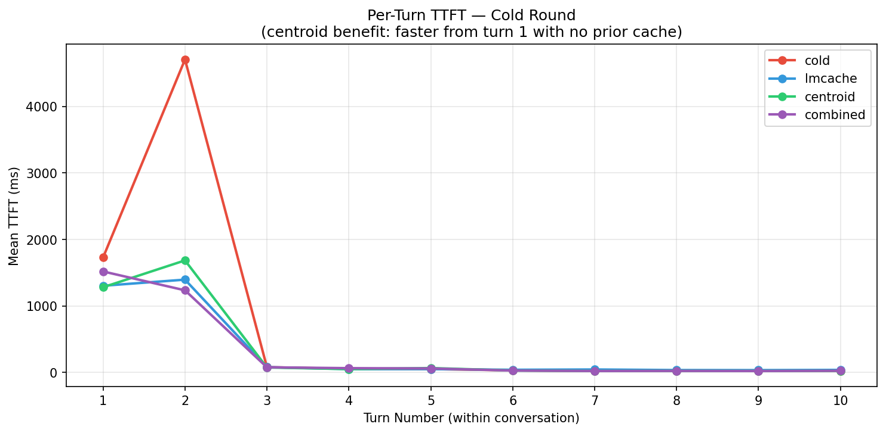
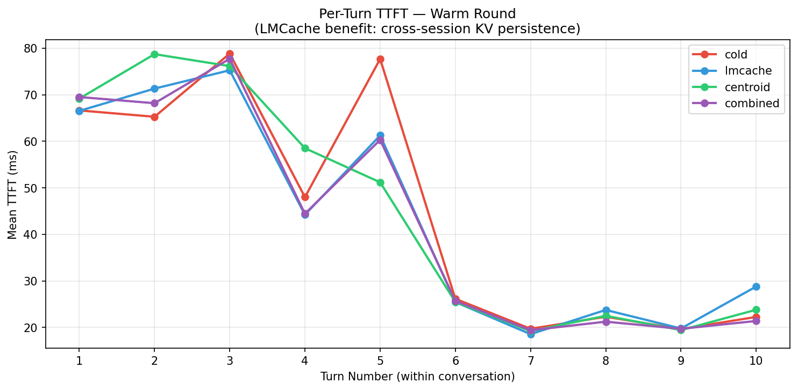
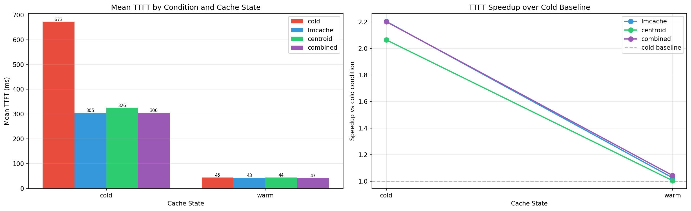

# AgentCache: Synthetic KV Caching for Domain-Specific Agents

Eliminates the TTFT prefill bottleneck for domain-specific LLM agents by replacing long system prompts with a small, gradient-trained KV-cache prefix injected directly into vLLM at inference time.

---

## Quick Start

```bash
# Install dependencies and patch vLLM
./install.sh
source venv/bin/activate

# Download a base model (gated models require: hf login)
./get_model.sh meta-llama/Llama-3.2-1B-Instruct

# Run the full pipeline: train adapter, export centroids, evaluate injection
python run_training_pipeline.py --model models/Llama-3.2-1B-Instruct --tokens 64
```

**Resume from checkpoint:**
```bash
# Adapter already trained
python run_training_pipeline.py --model models/Llama-3.2-1B-Instruct --tokens 64 --skip-train

# Centroids already exported
python run_training_pipeline.py --model models/Llama-3.2-1B-Instruct --tokens 64 --skip-train --skip-transpose

# Run all test modes
python run_training_pipeline.py --model models/Llama-3.2-1B-Instruct --tokens 64 --test-modes all
```

**Output paths:**

| Artifact | Path |
|---|---|
| Trained adapter | `agentcache_compression/adapters/N{tokens}/` |
| Centroid tensors | `agentcache_compression/centroids/N{tokens}_K.npy`, `..._V.npy` |
| Eval results | `agentcache_compression/results/N{tokens}_comparison.jsonl` |
| Downloaded model | `models/<model-name>/` |

---

## How It Works

**Phase 1: Train.** PEFT prefix-tuning produces a small adapter trained on domain-specific tasks (e.g. Python coding, general search). The adapter learns virtual tokens that encode the agent's system prompt behavior via backpropagation.

**Phase 2: Export.** The adapter weights are materialized into layer-wise `.npy` tensors of shape `[num_layers, N_virtual, kv_dim]`, one file for K and one for V.

**Phase 3: Inject.** A patched vLLM reads the `.npy` files at startup and writes their values directly into the GPU KV cache before each forward pass. The scheduler is told positions `0..N-1` are already computed, so they are never prefilled. The model processes only the user query tokens.

The patch touches four vLLM files:

| Source (repo) | Role |
|---|---|
| `vllm/centroid_injector.py` | Writes centroid tensors into KV cache blocks |
| `vllm/centroid_integration.py` | Wires injector into model runner and scheduler |
| `vllm/v1/worker/gpu_model_runner.py` | Calls injector on each forward pass |
| `vllm/v1/core/sched/scheduler.py` | Reports centroid slots as already computed |

Editing any of these files requires re-running `./install.sh` to copy them into site-packages.

**Runtime is controlled by env vars:**

```
VLLM_CENTROID_SCHEDULER=1
VLLM_CENTROID_K_PATH=.../centroid_K.npy
VLLM_CENTROID_V_PATH=.../centroid_V.npy
VLLM_CENTROID_SYS_TOKENS=0    # 0 = pure compression mode
```

With `VLLM_CENTROID_SCHEDULER=0` or unset, the patched vLLM behaves identically to stock vLLM.

---

## Results

### Single-agent benchmark (Llama-3.2-1B-Instruct)

TTFT at different context lengths, N=128 virtual tokens:

| Context length | Mode | Physical tokens | TTFT | Speedup |
|---|---|---|---|---|
| ~200 tokens | cold | ~276 | 20.8ms | baseline |
| ~200 tokens | centroid | ~184 | 18.7ms | 1.1x |
| ~1000 tokens | cold | ~1092 | 47.8ms | baseline |
| ~1000 tokens | centroid | ~184 | 17.0ms | **2.8x** |

At short contexts, fixed GPU overhead dominates and speedup is small. At 1000 tokens, prefill is the bottleneck and centroid injection reduces TTFT by 2.8x. Synthetic TTFT stays roughly flat regardless of original context length because the number of physically prefilled tokens is always N_virtual + user query length.

N ablation at 200-token context:

| N_virtual | Physical tokens | TTFT | Task pass rate |
|---|---|---|---|
| 64 | ~120 | ~17.8ms | 80% |
| 128 | ~184 | ~18.7ms | 84% |

Quality is similar at N=64 and N=128. The speedup is not sensitive to N above a minimum threshold.

---

### Multi-agent benchmark (Qwen2.5-1.5B-Instruct, NVIDIA T4)

Notebook: `LMCacheCentroidN256.ipynb`

Tests four conditions over 10 coding queries and 10 search queries, two rounds each (cold round then warm round). Each request is tagged by agent type and the injector selects the matching centroid (codingN256 or searchN256) per-request with no server restart.

| Condition | Description |
|---|---|
| cold | No LMCache, no centroid. Full prefill every request. |
| lmcache | CPU KV offload, LRU, chunk size 16. Warm requests reuse from round 1. |
| centroid | codingN256 or searchN256 injected at positions 0-255 every request. |
| combined | Centroid injection plus LMCache both active. |

**Cold-round mean TTFT (round 1, no prior session):**

| Condition | Mean TTFT | Speedup vs cold |
|---|---|---|
| cold | 1078ms | baseline |
| lmcache | 568ms | 1.90x |
| centroid | 547ms | 1.97x |
| combined | 494ms | **2.18x** |

LMCache has no stored KV on the first session so its cold-round gain comes from vLLM's native in-session prefix caching, which runs in all conditions. The centroid provides a guaranteed injection from turn 1 regardless of session state, which is why it outperforms LMCache in cold conditions. The combined system achieves the best result because the centroid seeds the first 256 positions and vLLM prefix caching can match a longer anchor for the rest of the system prompt.

**Per-turn breakdown (cold round, averaged over both agent types):**

| Turn | cold | lmcache | centroid | combined |
|---|---|---|---|---|
| 1 | 2585ms | 2200ms | 2102ms | 2097ms |
| 2 | 4362ms | 1872ms | 1762ms | 1214ms |
| 3+ | ~76-230ms | ~79-241ms | ~75-244ms | ~85-245ms |

The largest gains appear at turns 1-2, before vLLM's in-session prefix caching has warmed up. The combined condition cuts turn-2 TTFT by 3.6x compared to cold. The cold baseline also spikes again at turn 9 due to an in-session APC miss on a specific coding query. Centroid and combined conditions do not show this spike because the injected first-256-token KV provides a stable matching anchor.

**Warm-round mean TTFT (round 2, all session state populated):**

All four conditions converge to 74-75ms with under 15ms of variation across all turns.

**Model quality (ROUGE-L vs cold baseline, temperature=0):**

All three non-cold conditions score 1.0 ROUGE-L against the cold baseline across all query types, cache rounds, and agent types. Centroid injection introduces no quality degradation under greedy decoding.

**Charts:**




